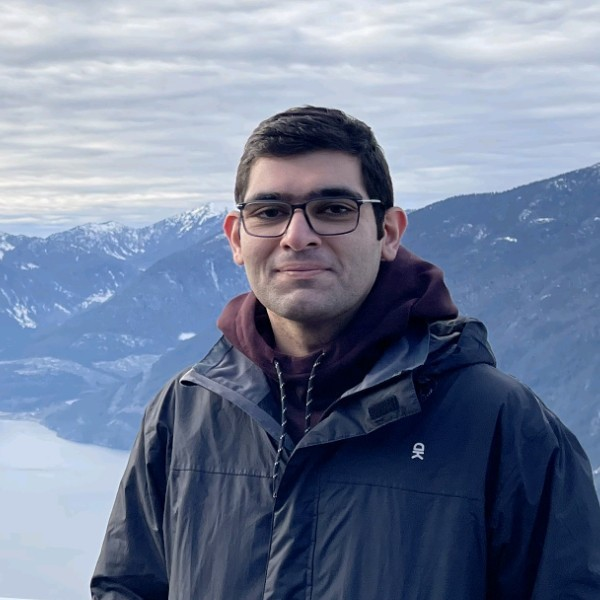

# Amir Mehdi Soufi

I am a Ph.D. Candidate at the University of Victoria in Canada. I have worked on multiple robotic and intelligent systems projects, mostly focused on applied Reinforcement Learning. My interests include reinforcement learning, representation learning, deep generative models, simulation and modeling, robot design and control, and intelligent manufacturing. Previously, I studied control theory and applied design and worked as a mechanical design engineer and automation engineer.

**[Google Scholar](https://scholar.google.com/citations?user=_hhVX9QAAAAJ&hl=en)** / **[LinkedIn](https://www.linkedin.com/in/amsoufi/)** / **[Email](mailto:am.soufi@gmail.com)**

## Current Projects

- **Transformer-Encoder-Decoder for Zero-shot Adaptation**  
  Developing a Transformer-based task-conditioned meta-RL model that encodes the embedding of interaction histories. Designed for sample-efficient generalization to unseen manipulation tasks using representation learning in high-dimensional state-action spaces.

- **Guided Diffusion for Path Planning**  
  Collaborating on the development of a guided conditional diffusion model for robot manipulators. The model adapts to the environment and robot variations by encoding 3D point-cloud observation, enabling robust generation of feasible motion trajectories in high-dimensional planning spaces.

## Publications

- Z. Zhang, J. Hong, **A. M. S. Enayati**, and H. Najjaran. *Using Implicit Behavior Cloning and Dynamic Movement Primitive to Facilitate Reinforcement Learning for Robot Motion Planning*, **IEEE Transactions on Robotics**. ([Link](https://ieeexplore.ieee.org/abstract/document/10694731))

**Abstract:** Reinforcement learning (RL) for motion planning of multi-degree-of-freedom robots still suffers from low efficiency in terms of slow training speed and poor generalizability. In this article, we propose a novel RL-based robot motion planning framework that uses implicit behavior cloning (IBC) and dynamic movement primitive (DMP) to improve the training speed and generalizability of an off-policy RL agent. IBC utilizes human demonstration data to leverage the training speed of RL, and DMP serves as a heuristic model that transfers motion planning into a simpler planning space. To support this, we also create a human demonstration dataset using a pick-and-place experiment that can be used for similar studies. Comparison studies reveal the advantage of the proposed method over the conventional RL agents with faster training speed and higher scores. A real-robot experiment indicates the applicability of the proposed method to a simple assembly task. Our work provides a novel perspective on using motion primitives and human demonstration to leverage the performance of RL for robot applications.

- Y. Karpichev, T. Charter, J. Hong, **A. M. S. Enayati**, H. Honari, M. G. Tamizi, and H. Najjaran. *Extended Reality for Enhanced Human-Robot Collaboration: a Human-in-the-Loop Approach*, **IEEE ROMAN 2024**. ([Link](https://ieeexplore.ieee.org/abstract/document/10731170))

- H. Honari, **A. M. S. Enayati**, M. G. Tamizi, and H. Najjaran. *Meta SAC-Lag: Towards Deployable Safe Reinforcement Learning via MetaGradient-based Hyperparameter Tuning*, **IEEE IROS 2024**. ([Link](https://ieeexplore.ieee.org/abstract/document/10802547))

- J. Sol, **A. M. S. Enayati**, and H. Najjaran. *Visual Deformation Detection Using Soft Material Simulation for Pre-training of Condition Assessment Models*, **IEEE CASE 2024**. ([Link](https://arxiv.org/abs/2405.14877))

- N. Mahdian, M. Jani, **A. M. S. Enayati**, and H. Najjaran. *Ego-Motion Aware Target Prediction Module for Robust Multi-Object Tracking*, **arXiv**. ([Link](https://arxiv.org/abs/2404.03110))

- **A. M. S. Enayati**, R. Dershan, Z. Zhang, D. Richert, and H. Najjaran. *Facilitating Sim-to-Real by Intrinsic Stochasticity of Real-Time Simulation in Reinforcement Learning for Robot Manipulation*, **IEEE Transactions on AI**. ([Link](https://ieeexplore.ieee.org/abstract/document/10196019))

- **A. M. S. Enayati**, Z. Zhang, H. Najjaran. *A Methodical Interpretation of Adaptive Robotics: Study and Reformulation*, **Neurocomputing**, 2022. ([Link](https://www.sciencedirect.com/science/article/pii/S0925231222012073))

- **A. M. S. Enayati**, Z. Zhang, K. Gupta, H. Najjaran. *Exploiting Symmetry and Heuristic Demonstrations in Off-policy Reinforcement Learning for Robotic Manipulation*, submitted to **Springer Neural Computing & Applications**. ([Link](https://arxiv.org/abs/2304.06055))

- Z. Zhang, R. Dershan, **A. M. S. Enayati**, M. Yaghoubi, D. Richert, H. Najjaran. *A High-Fidelity Simulation Platform for Industrial Manufacturing by Incorporating Robotic Dynamics into an Industrial Simulation Tool*, **IEEE RA-L**. ([Link](https://ieeexplore.ieee.org/abstract/document/9827559))

- H. Shayestehpour, K. Nassiri Nazif, **A. M. S. Enayati**, M. S. Saidi. *Proposing a high-efficiency dielectrophoretic system for separation of dead and live cells*, **Scientia Iranica**. ([Link](https://scientiairanica.sharif.edu/article_4502.html))

- A. M. Nasrabadi, A. R. Eslaminia, **A. M. S. Enayati**, L. Alibiglou and S. Behzadipour. *Optimal Sensor Configuration for Activity Recognition during Whole-body Exercises*, **IEEE ICRoM 2019**. ([Link](https://ieeexplore.ieee.org/abstract/document/9071849))

## Patents

- M. Durali, M. H. Heydari, **A. M. S. Enayati**, S. M. Hosseini. *Testing mechanical overspeed protection systems*, **US Patent No. 2024/0003264 A1**, 2024.

- M. Durali, M. A. Soleimani, F. F. Shabani, A. Habibollahi, A. Sohbatloo, **A. M. S. Enayati**. *Controlling acoustics of a performance space*, **US Patent No. 2019/0292774 A1**, 2019.

## Education
  
- Ph.D. in Mechanical Engineering, University of Victoria/University of British Columbia, Canada
- M.Sc. in Mechanical Engineering - Control Systems, Sharif University of Technology, Tehran, Iran
- B.Sc. in Mechanical Engineering, Sharif University of Technology, Tehran, Iran
